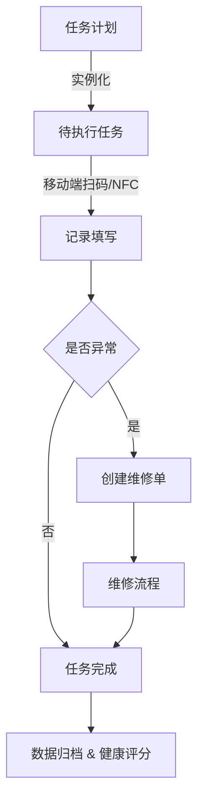

# 需求分册

## 功能定义与业务流程

**子文档版本控制**：

-   初稿：2025.04.23
-   审核人：Jacky
-   第一次修改：2025.08.16

此方案可直接交付架构师进行详细设计，需重点关注**任务计划引擎的时序逻辑**、**设备-项目-任务实例的三级关联关系**、以及**设备健康率**的概念。

### **1. 文档概述**

**目标**：为系统架构师及开发团队提供明确的功能定义与数据逻辑规范，指导 ER 图设计与程序开发。

**范围**：覆盖设备巡检、点检、保养、维修全生命周期管理功能，包含任务计划、执行记录、关联关系等核心业务逻辑。

### **2. 专有名词定义**

1. **设备日常/定期巡检**

操作人员按固定周期对设备外观、功能、环境、运行数据等进行的标准化定性检查，目标为预防性维护。

2. **设备点检**

由专业人员使用专业仪器对设备关键参数（振动、温度等）、仪表量程准确性等进行定量检测的技术性检查，目标为预测性维护。

3. **设备保养**

根据预设规则对设备进行清洁、润滑、校准等预防性维护操作，避免性能劣化。

4. **设备维修**

对故障设备进行修复或部件更换的纠正性维护行为，包含故障诊断、备件更换、调试验收等环节。

### 3. 角色与权限

| **角色**   | **主要权限**                            | **备注** |
| :--------- | :-------------------------------------- | :------- |
| 设备管理员 | 设备类型、设备台账 CRUD                 |          |
| 运维主管   | 任务计划编制、负责人指派、超时告警策略  | 可选     |
| 检修员     | 查看任务、执行/填写检查记录、创建维修单 | 可选     |
| 审核员     | 审核点检/巡检/保养/维修记录             | 可选     |
| 监控大屏   | 只读任务进度与告警                      |          |

设备巡检：通常为企业的值班人员

设备点检、保养、维修：通常为企业的维修班组人员或外委运维公司

### 4. 功能概述

1. 设备类型与设备属性模板管理
2. 设备二维码管理
3. 设备台账建档与生命周期状态维护
4. 点检/巡检/保养项目库维护
5. 巡检计划编制与周期批次调度
6. 批次任务生成
7. 超时告警控制、事件日志记录与事件推送
8. 现场任务执行与图文多媒体记录（移动端）
9. 设备档案查看（扫描设备二维码），四类记录查看（移动端）
10. 维修工单创建、维修完成结果填报
11. 历史任务与维修记录多维查询
12. 单设备、部门及全局健康度实时计算
13. 提供多维查询与健康度开放 API 接口对接大屏展示系统

### **5. 功能需求详述**

#### **5.1 设备类型管理**

-   **功能描述**：
    -   设备类型新增 / 编辑 / 禁用 / 删除（逻辑删除），**若被设备引用则禁止删除**
    -   支持树形结构定义设备分类（如一级分类：电气设备 → 二级分类：变压器/电动机）
    -   自定义设备类型属性模板，每个类型可配置扩展字段（键/类型/单位），在台账录入时动态渲染表单
-   **数据表设计**：
    -   设备类型表：mes_device_type

#### **5.2 设备台账管理（设备基本信息）**

-   **功能描述**：
    -   基础 CRUD 功能：支持设备信息（名称、编号、型号、所属类型、安装位置、状态、责任人、投运日期等）管理、二维码/标签、图片附件、维保资料（图片、PDF 附件）、设备资料（图纸、说明书等）
    -   生命周期状态：待安装 -> 运行 -> 维修 -> 报废（这里的运行为正常的含义，并非“运转”的含义）
    -   历史沉淀：
        -   关联记录查询：关联查询 4 类记录，点检/巡检/保养/维修记录（按时间/负责人筛选）
        -   健康度：设备健康评分
        -   最新报警：预留，后期通过调用 IoT 模块提供数据接口获取报警数据
    -   地图定位：经纬度字段，为支持 GIS 可视化提供支持。
-   **数据表设计**：
    -   设备主表：mes_device

#### **5.3 项目库（点检/巡检/保养项目管理）**

-   **功能描述**：
    -   项目模板库：预置标准检查项（如"轴承、温度检测"）及自定义扩展
    -   项目属性：定义项目名称、检查内容、标准值/允许范围、记录方式（数值/枚举/文本/照片）
    -   项目归属类型：点检、巡检、保养（多选可复用）
    -   生命周期：启用 / 停用（历史不可删除）
-   **数据表设计**：
    -   检查项目表：mes_insp_item_tpl
    -   ems_rel_devtype_insp_item（设备类型 ↔ 检查项目，默认关联）
    -   ems_rel_device_insp_item_ovr（设备 ↔ 检查项目，覆盖/特例）

#### **5.4 任务计划编制**

-   **功能描述**：
    -   **计划配置**：
        -   基本信息：名称、描述、所属部门
        -   计划周期：计划在该周期内实例化任务，起止日期 (可勾选「长期」= 无结束日期)
        -   频次策略：小时/天/周/月/季/年（需支持类 Cron 表达式，如 `0 8 * * 1` 表示每周一 8 点）
        -   开始时间：仅巡检使用有意义，支持 HH:mm，其他归属类型通常设置为 null，若为空则任何时间可执行
        -   控制开关：开关状态为 false 时，含义为此计划被停止，不在实例化任务
        -   任务时限：逾期自动转 **超时**；为空则认为无时限要求
        -   超时报警开关：默认存储超时记录日志；可选告警推送渠道：短信/钉钉/邮件
        -   负责人：支持绑定巡检执行人
        -   执行范围：用户/角色/部门集合，用于控制可领取范围）；
        -   分派策略：0 自领/1 固定预派/2 轮询）。
    -   **任务池生成逻辑**：
        -   任务项 = 一台设备 + 一个检查项目（1 个任务计划可绑定 N 个设备与 M 个项目）
        -   自动生成周期实例：根据频次生成具体待执行任务（如每日 8 点生成巡检任务）
-   **数据表设计**：
    -   任务计划表：ems_insp_plan
    -   计划明细表：ems_insp_plan_item（即任务项 ，一行即一组合）
    -   周期整体任务壳：ems_insp_batch
    -   任务实例表：ems_insp_task
-   **一句话总结：**
    -   ems_insp_plan 决定“什么时候、周期多长”；
    -   ems_insp_plan_item “对象”，确定“检哪台设备的哪个项目”；
    -   ems_insp_batch 每到一个周期先生成整体任务壳；
    -   ems_insp_task 再把每条 plan_item 落地为本批次的子任务；
    -   ems_insp_task_record 记录现场结果。

注：对于超时报警的处理，创建一个接口，本期仅实现日志的记录的功能；下一阶段实现短信/钉钉/邮件的消息推送

#### 5.5 任务执行与记录-移动端

-   **功能描述**：
    -   巡检任务
        -   任务领取：移动端拉取实例化的任务（条件：计划编制设置的开始时间 ≤ 当前时间）；同设备项目聚合展示与批量领取
        -   巡检人拍照上传（目的，检验巡检人着装，比如穿戴劳保服装）
        -   支持添加协助人并拍照上传（目的：赋予规范要求，一人作业，一人监护，同时检验协助人着装是否合规）
        -   移动端扫码/NFC 打卡（二维码贴在待巡检设备上），获取设备 ID ，必须扫码才能进行记录填报。（扫码目的：监督巡检人巡检必须到设备位置）
        -   填写记录：表单+拍照+语音+视频
        -   提交 ：提交后“自动通过”
        -   现场发现异常可一键“生成维修单”，携带任务上下文。
    -   点检任务
        -   功能与“巡检任务”相同
    -   保养任务
        -   功能与“巡检任务”相同
    -   维修任务
        -   功能与“巡检任务”相同

_注：本期填写记录，仅要求实现表单数据和拍照，二期再实现语音和视频的记录_

#### 5.6 设备查看-移动端

-   **功能描述**：
    -   查看设备台账
        -   通过移动端扫描设备二维码，查看完整的设备台账内容
    -   四类记录查看
        -   在设备台账页面，可通过 tab 页面方式，查看设备的四类记录信息
    -   资料手册查看
        -   在设备台账页面，可通过 tab 页方式，查看设备的资料、操作手册、实时数据运行记录等内容

_注：实时数据运行记录查看功能预留，后期通过 IOT 模块提供的实时数据，历史数据接口获取_

#### **5.7 任务记录查询**

-   **功能描述**：
    -   多维筛选：设备、状态、完成度、负责人、时间段。
    -   统计：完成率、超时率、超时报警次数（用于健康评分算法）
    -   图表：任务趋势折线、异常 TOP 10 设备柱状。
-   **数据表设计**：
    -   执行任务记录： ems_insp_task_record

#### **5.8 维修管理**

-   **功能描述**：
    -   **创建来源**
        -   任务界面“一键报修”；点检/巡检/保养任务内直接触发
        -   独立工单入口；维修模块中手工录入创建
    -   **工单流程**
        -   工单创建（关联设备、故障现象、紧急程度）
        -   维修处理（备件更换记录、维修方法、耗时）
        -   验收确认（验收人、测试结果、关闭工单）
    -   **流程字段**
        -   维修单号、设备、故障描述、优先级、责任人、预计完成时间、实际完成时间、费用。
    -   **闭环**
        -   审核通过后同步更新设备状态。
        -   维修记录与原任务互链，便于追溯
-   **数据表设计**：
    -   维修工单表: ems_repair_order

注：本期流程中，不需要考虑角色问题，流程只考虑创建、处理、验收确三两步，即插入数据（创建）——>更新数据（处理）——>更新数据（验收）

### 6. 重点逻辑说明

#### 6.1 “两类场景”

-   **现场执行场景** – 维修/巡检人员在移动端扫码，看到的是 **单台设备 + 单个检查项目** 的最小任务；这样可以并发处理、独立打卡、各自判定合格/不合格。
-   **管理监控场景** – 主管希望把一次周期（同一个计划、同一个开始时间）视为 **整体任务批次**：只关心它是否在整体时限内全部完成、是否整体超时、整体完成率等，用于 KPI、告警、大屏展示。

<font style="color:rgb(119, 119, 119);">细粒度任务 (`<font style="color:rgb(119, 119, 119);background-color:rgb(243, 244, 244);">mes_insp_task`<font style="color:rgb(119, 119, 119);">) 满足第一类场景；批次壳 (`<font style="color:rgb(119, 119, 119);background-color:rgb(243, 244, 244);">mes_insp_batch`<font style="color:rgb(119, 119, 119);">) 汇总子任务状态，满足第二类场景。

#### 6.2 增加 “整体任务壳”

| **表**              | **主要字段**                                                                                                                                                                                                                                                                                                                                                                   | **说明**                                     |
| :------------------ | :----------------------------------------------------------------------------------------------------------------------------------------------------------------------------------------------------------------------------------------------------------------------------------------------------------------------------------------------------------------------------- | :------------------------------------------- |
| ** mes_insp_batch** | `id`<br/> PK `plan_id`<br/> FK → ems_task_plan.id `cycle_no`<br/> INT（第几次触发，从 1 递增） `schedule_time`<br/> DATETIME（本次理论开始） `deadline`<br/> DATETIME（= schedule_time + time_limit）`status`<br/> ENUM(pending / in_progress / done / overdue / partial_overdue)`start_at`<br/> DATETIME（第一条子任务开始时间）`finish_at`<br/> DATETIME（最后一条完成时间） | “整体任务壳” 对应 _某个计划_ 在 _某个周期点_ |

| **原表**            | **新增字段**                      | **说明**                     |
| :------------------ | :-------------------------------- | :--------------------------- |
| ** mes_insp_task ** | `batch_id` FK → ems_task_batch.id | 每条细粒度任务隶属于一个批次 |

#### **6.3 **`mes_insp_batch `与 `mes_insp_task` 的区别

| 维度         | `**mes_insp_batch **`<br/> (批次壳)                                                                              | `mes_insp_task`<br/> (执行单元)                                          |
| ------------ | ---------------------------------------------------------------------------------------------------------------- | ------------------------------------------------------------------------ |
| 粒度         | 一次周期的 **整体任务**                                                                                          | 一台设备 + 一个项目的 **最小任务**                                       |
| 典型数量关系 | 1 条 / 周期 / 计划                                                                                               | N 条 = 批次 × 计划明细数                                                 |
| 主要作用     | - 记录该周期的 `schedule_time / deadline` - 汇总子任务状态：完成率、超时 - 超时告警触发点 - KPI / 大屏用整体进度 | - 供巡检/点检人员领取、扫码、填报 - 决定设备健康度、超时、照片等明细数据 |
| 状态字段     | pending / in_progress / done / overdue / partial_overdue                                                         | pending / in_progress / done / overdue                                   |
| 典型查询     | “5 月第一周锅炉房巡检是否整体完成？”                                                                             | “1#水泵电流检查完成了吗？结果多少？”                                     |

#### 6.4 生成关系

```plain
mes_insp_plan                1 ──► N  mes_insp_batch         1 ──► N  mes_insp_task
（计划主题）                 （本周期整体任务）               （设备+项目单元）
```

伪代码

```sql
FOR 每个 mes_insp_plan 按 cron 触发周期点 T:
    INSERT mes_insp_batch(plan_id, cycle_no++, schedule_time=T, deadline=T+time_limit)

    FOR 每条 mes_insp_plan_item 属于该 plan:
        INSERT mes_insp_task(batch_id=刚插入batch.id,
                             plan_item_id,
                             schedule_time=T,
                             deadline=T+time_limit,
                             status='pending')
```

#### 6.5 状态联动

-   **子任务首次被领取** → `mes_insp_batch.status = in_progress` & `start_at = NOW()`
-   **全部子任务完成** → `mes_insp_batch.status = done` & `finish_at = MAX(task.finished_at)`
-   **到 deadline 有未完成** → `mes_insp_batch.status = overdue / partial_overdue` + 触发一次整体告警

<font style="color:rgb(119, 119, 119);">通过批次表即可满足 **<font style="color:rgb(119, 119, 119);">“整体任务是否完成 / 是否超时”**<font style="color:rgb(119, 119, 119);"> 的判定与告警，而不影响子任务的独立执行。

### 7. 业务流程概览



### 8. 关键业务规则

1. **任务生成**：每日定时 Job 根据 cron_expr 滚动创建未来 N 天任务（N 可配置，默认 5）。
2. **超时判定**：若 现在 > (schedule_time + time_limit) 且任务未完成，则置为“超时”；若 alarm_switch=On，则推告警事件。
3. **健康评分**：基础公式可设为

100 − ( 超时任务数 × 3 + 报警数 × 5 + 未完成任务数 × 2 );

分数 < 60 触发“重点关注”标签。

4. **数据完整性**：设备、项目一旦被计划引用后不可物理删除，只能停用。

### 9. 健康度分析（亮点）

| **维度**         | **指标**                                 | **公式 & 说明**                                          |
| :--------------- | :--------------------------------------- | :------------------------------------------------------- |
| **单设备健康度** | `health_score_device`                    | 100 - (超时 × 3 + 报警 × 5 + 未完 × 2)；最低 0，最高 100 |
| **部门健康度**   | `health_score_dept`                      | 该部门设备健康度加权平均（权重 = 台账原值或重要度）      |
| **全局健康度**   | `health_score_org`                       | 全部设备加权平均；趋势图展示近 30 天曲线                 |
| 标签             | 健康 ≥ 90：优秀；70‑89：关注；< 70：风险 | 颜色：绿/黄/红                                           |

<font style="color:rgb(119, 119, 119);">设备健康度字段每日离线任务计算；结果写入专用表并推送到大屏。

### **10. 非功能性需求**

1. **性能要求**：
    - 数据量与用户数较小，不必按大应用系统，考虑性能问题
2. **数据一致性**：
    - 删除资源时，需要考虑若被引用提示无法删除
3. **报警机制**：
    - 超时任务每小时扫描一次，通过消息队列异步触发告警（避免阻塞主线程），由于数据类不大，使用 spring 默认队列即可满足性能要求
